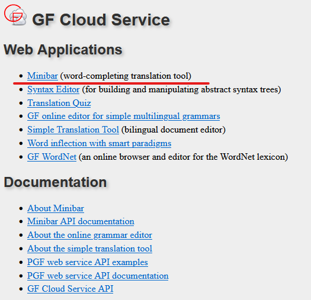
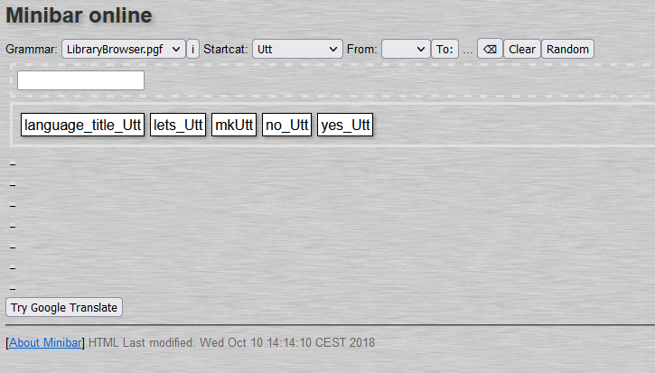
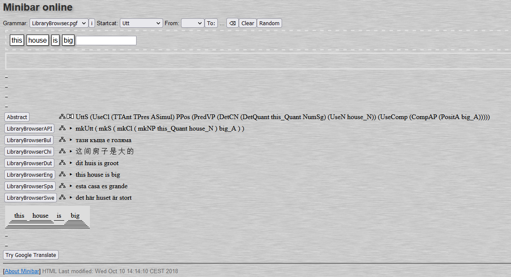
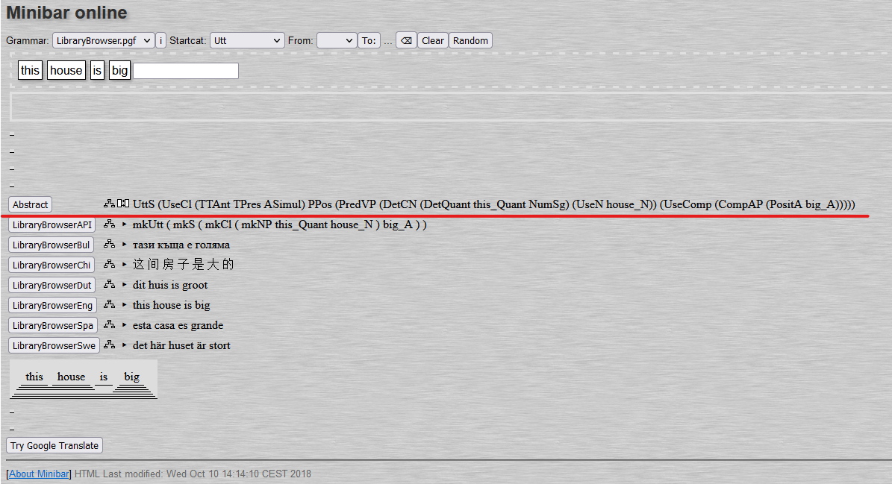
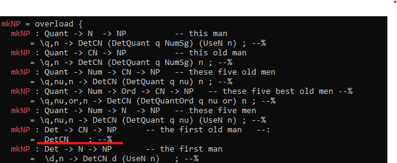
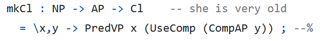

========================================================
Implementing a Resource Grammar Depth-First: First Steps
========================================================

Here we're assuming a few prerequisites:
- You have written some small GF grammars before, or are otherwise familiar with GF syntax and module structure. You know about ``cat``, ``fun``, ``lincat``, ``lin`` and ``oper`` definitions, and you know what ``abstract``, ``concrete`` and ``resource`` modules are. If not, read lessons 1 and 2 of the `GF tutorial <http://www.grammaticalframework.org/doc/tutorial/gf-tutorial.html>`__ first.
- You have seen, or perhaps used yourself, the RGL API to implement linearisations. You know what a line like ``mkCl (mkNP i_Pron) old_A`` means, and when to use it: as a linearisation to some function, e.g. ``lin TrueFactAboutMe = mkCl (mkNP i_Pron) old_A``.

You know these things, and you would like to implement a resource grammar for a new language. To get started, we have a very concrete goal: to implement just enough grammar to be able to linearise the Foods grammar, which was introduced in lesson 2 of the GF tutorial. There is a version implemented using the resource grammar in the `gf-contrib repository <https://github.com/GrammaticalFramework/gf-contrib/blob/master/foods/FoodsI.gf>`__: lexicon aside, the implementation is as follows.

.. code-block:: haskell

  lincat
    Comment = Utt ;
    Item = NP ;
    Kind = CN ;
    Quality = AP ;
  lin
    Pred item quality = mkUtt (mkCl item quality) ;
    This kind = mkNP this_Det kind ;
    ...
    Mod quality kind = mkCN quality kind ;
    Very quality = mkAP very_AdA quality ;

We want to make a fully functional subset of the RGL, so that we can plug in our grammar (for example, Tamil) just like this:

.. code-block:: haskell

   concrete FoodsTam of Foods = open SyntaxTam, ParadigmsTam in {

   lincat
     Comment = Utt ;
     Item = NP ;
     Kind = CN ;
     Quality = AP ;
    lin
      Pred item quality = mkUtt (mkCl item quality) ;
      This kind = mkNP this_Det kind ;
      ...
      Mod quality kind = mkCN quality kind ;
      Very quality = mkAP very_AdA quality ;

      Pizza = mkN "பீத்சா" ;
      ...

 After we're done with the exercise, all the infrastructure is in place, but a lot of grammatical structures is still missing. So if you tried to use the new language to implement another application grammar, it would *compile*, but not *linearise*. But the good news is that once you're past the initial hurdle of getting all the modules working, the rest is just grammar engineering. And that's fun!

 Note that this approach is not for everyone. Jumping right to the full resource grammar can be overwhelming; in that case, you could try a `mini resource grammar <https://github.com/GrammaticalFramework/gf-contrib/blob/master/mini/newmini/MiniGrammar.gf>`__ instead. But that will be the topic of another tutorial—this one is for you if you want to jump right in to the full RGL.

------------------------------------------
Alternative 1: You have access to GF Cloud
------------------------------------------

1. Go to `GF Cloud <https://cloud.grammaticalframework.org/>`__. Choose
   “Minibar”

2. For the Grammar, choose “LibraryBrowser.pgf”. For the StartCat,
   choose the start category “Utt”.

3. Type in the sentence you want to implement, e.g. “this house is big”.
   You will have to press “Enter” multiple times to input the sentence.
   You should get something like the following:

4. Scroll to the bottom. The first output is the syntax tree you want to
   implement, from the inner-most functions to the outer-most. So in
   this example, if you want to implement the Adjective “big_A”, you
   need to implement “PositA” first, then “CompAP”, then finally
   “UseComp”. See :ref:`stage_1` for
   how to implement these functions.

-------------------------------------------------
Alternative 2: You do not have access to GF Cloud
-------------------------------------------------

1. Find the overloaded oper you want to implement. For example, mkNP

2. Go to the `RGL
   Synopsis <https://www.grammaticalframework.org/lib/doc/synopsis/index.html>`__.
   If you lose this link, you can find the RGL Synopsis on the
   `Grammatical Framework
   website <https://www.grammaticalframework.org/>`__

   .. image:: ../images/Pastedimage20230113103213.png

3. Search for the oper you want. In this case, we search for mkNP. The
   below screenshot is a snippet of the different mkNP opers you will
   find

   .. image:: ../images/Pastedimage20230113103050.png

4. Find the type of mkNP you wish to implement. In our example, we will
   use “Det -> CN -> NP” which is represented with the example “the five
   old men” here.

5. Now, go to the Constructors API. You have two options. You can either
   go to the github page found here:
   `gf-rgl/master/src/api/Constructors.api <https://github.com/GrammaticalFramework/gf-rgl/blob/master/src/api/Constructors.gf>`__
   or you can open the file up in your own computer with the following
   commands, assuming you are in your gf-rgl folder.

.. code-block::

   $ cd src/api
   $ grep -A1 <OPER> Constructors.gf

In our example, we want to grep for “mkNP”, so we would type “grep -A1
mkNP Constructors.gf”

6. We find the following “Det -> CN -> NP”. Take note of the function
   after the equal sign, in this case, it’s DetCN. Note that that the
   example phrase given, “the first old man”, is different from the
   previous example “the five old men”. This has no bearing on our
   implementation, though it might confuse you.:

7. Now you have to find where the function is in your Resource Grammar.
   If you don’t know where the function is, you can grep it. In our
   case, we want to implement DetCN, so we will use the following
   command:

.. code-block::

   $ grep DetCN *.gf

This will search for DetCN in all .gf files.

8. Implement the function! You might need to implement other functions.
   In that case, return to step 6 and search for the function. Consider
   a different function, mkCl. You will have to implement PredVP,
   UseComp and CompAP as they make up the implementation of mkCl :

