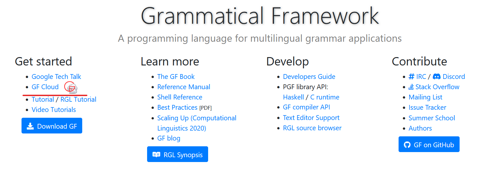

--------------------------------------
ALTERNATIVE 1: HAVE ACCESS TO GF CLOUD
--------------------------------------

1. Go to `GF Cloud <https://cloud.grammaticalframework.org/>`__. Choose
   “Minibar”

.. image:: ../images/Pastedimage20230113123514.png

2. For the Grammar, choose “LibraryBrowser.pgf”. For the StartCat,
   choose the start category “Utt”.

3. Type in the sentence you want to implement, e.g. “this house is big”.
   You will have to press “Enter” multiple times to input the sentence.
   You should get something like the following:

.. image:: ../images/Pastedimage20230113123656.png

4. Scroll to the bottom. The first output is the syntax tree you want to
   implement, from the inner-most functions to the outer-most. So in
   this example, if you want to implement the Adjective “big_A”, you
   need to implement “PositA” first, then “CompAP”, then finally
   “UseComp”. See :ref:`stage_1` for
   how to implement these functions.

.. image:: ../images/Pastedimage20230113123753.png

------------------------------------
ALTERNATIVE 2: NO ACCESS TO GF CLOUD
------------------------------------

1. Find the overloaded oper you want to implement. For example, mkNP

2. Go to the `RGL
   Synopsis <https://www.grammaticalframework.org/lib/doc/synopsis/index.html>`__.
   If you lose this link, you can find the RGL Synopsis on the
   `Grammatical Framework
   website <https://www.grammaticalframework.org/>`__

   .. image:: ../images/Pastedimage20230113103213.png

3. Search for the oper you want. In this case, we search for mkNP. The
   below screenshot is a snippet of the different mkNP opers you will
   find

   .. image:: ../images/Pastedimage20230113103050.png

4. Find the type of mkNP you wish to implement. In our example, we will
   use “Det -> CN -> NP” which is represented with the example “the five
   old men” here.

5. Now, go to the Constructors API. You have two options. You can either
   go to the github page found here:
   `gf-rgl/master/src/api/Constructors.api <https://github.com/GrammaticalFramework/gf-rgl/blob/master/src/api/Constructors.gf>`__
   or you can open the file up in your own computer with the following
   commands, assuming you are in your gf-rgl folder.

.. code-block:: 

   $ cd src/api
   $ grep -A1 <OPER> Constructors.gf

In our example, we want to grep for “mkNP”, so we would type “grep -A1
mkNP Constructors.gf”

6. We find the following “Det -> CN -> NP”. Take note of the function
   after the equal sign, in this case, it’s DetCN. Note that that the
   example phrase given, “the first old man”, is different from the
   previous example “the five old men”. This has no bearing on our
   implementation, though it might confuse you.:

.. image:: ../images/Pastedimage20230113104052.png

7. Now you have to find where the function is in your Resource Grammar.
   If you don’t know where the function is, you can grep it. In our
   case, we want to implement DetCN, so we will use the following
   command:

.. code-block:: 

   $ grep DetCN *.gf

This will search for DetCN in all .gf files.

8. Implement the function! You might need to implement other functions.
   In that case, return to step 6 and search for the function. Consider
   a different function, mkCl. You will have to implement PredVP,
   UseComp and CompAP as they make up the implementation of mkCl :

.. image:: ../images/Pastedimage20230113104702.png

